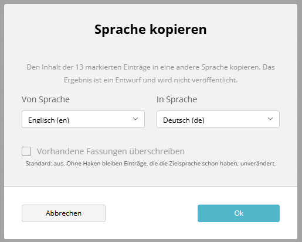

# Copy locale

The bulk action "Copy locale" copies the content of one language into another for many entries at once.
It does the same as "Copy locale" in the toolbar of the form, only for all selected entries of a list.



---

## Workflow

1. Select entries in the list (articles or snippets).
2. "Bulk actions" → "Copy locale".
3. In the dialog, choose the source language ("From language") and the target language ("To language"). The target cannot be the source.
4. "OK": the result is shown in a dialog, also when everything worked.

The languages to choose from are those of the list (the content languages of the webspaces). If the list has only one language, the action is not in the menu.

---

## Rules

| Case                                  | Behaviour                                                                                               |
|---------------------------------------|---------------------------------------------------------------------------------------------------------|
| Entry has the source language         | The draft of the source language is copied into the target language.                                    |
| Result                                | Always a **draft** in the target language. Nothing is published; an existing live version stays as it is. |
| Entry has no source language          | Skipped and reported with its title ("has no German version").                                         |
| Entry already has the target language | **Not** overwritten, but skipped and reported with its title.                                           |
| "Overwrite existing versions"         | Switch in the dialog, default: off. When checked, the draft of the target language is replaced.         |
| No permission                         | Skipped and reported (see Permissions).                                                                 |

The titles in the messages come from the source language if possible, otherwise from another language of the entry.

---

## Permissions

As for the other bulk actions, there are two levels:

| Level   | Context                                                                  | Permission                         |
|---------|--------------------------------------------------------------------------|------------------------------------|
| Switch  | `sulu.bulk_actions.actions` ("BulkActions" in the role form)             | "Edit"                             |
| Entry   | Context of the entry (article group, `sulu.snippet.snippets`, webspace)  | "Edit" **in the target language**  |

If a role is restricted to certain languages in the user settings, the target language counts.
For pages, the permissions of the single page ("Permissions" tab) are checked as well.

---

## Configuration

Articles and snippets get the action without further configuration. If you set the actions of a list yourself,
add `copy_locale`:

```yaml
sulu_bulk_actions:
    resources:
        articles:
            view_prefixes: ['sulu_article.article.list_']
            actions: [publish, unpublish, copy_locale]
```

**Pages:** the handler for pages exists (`resourceKey` `pages`, `copy_locale` only). The page tree of Sulu cannot select
entries, so the action does not appear there. A project with its own page list (a list view with `resourceKey` `pages`)
adds it under `resources.pages`.

---

## Endpoint

`POST /admin/api/bulk-actions/{resourceKey}/copy_locale?locale=de`

```json
{
    "ids": ["…", "…"],
    "sourceLocale": "de",
    "targetLocale": "en",
    "overwrite": false
}
```

Response (in addition to the fields described in [Result of a bulk action](results.en.md)):

| Field          | Content                                                                    |
|----------------|----------------------------------------------------------------------------|
| `missing`      | entries without a version in the source language                           |
| `existing`     | entries that already have the target language (only without `overwrite`)  |
| `locale`       | source language                                                            |
| `targetLocale` | target language                                                            |
| `skipped`      | list `{id, title, reason}`; `reason` is `missing` or `existing`            |

| Status | When                                                                          |
|--------|-------------------------------------------------------------------------------|
| 200    | at least one entry copied                                                     |
| 400    | source or target language missing, unknown, or both the same                  |
| 422    | nothing copied, entries without source language or with existing target       |
| 403    | nothing copied, only entries without permission                               |
| 500    | nothing copied, at least one entry failed                                     |

---

## Own handlers

A handler offers `copy_locale` if it implements `Manuxi\SuluBulkActionsBundle\Handler\LocaleCopyHandlerInterface`.
The interface extends `EntryInfoProviderInterface` (see [Result of a bulk action](results.en.md)), so missing and existing
languages are detected up front.

| Method                                                  | Returns                                    |
|---------------------------------------------------------|--------------------------------------------|
| `copyLocale(array $ids, $sourceLocale, $targetLocale)`  | `['done' => [...], 'failed' => [id => …]]` |

Handlers based on `ContentWorkflowBulkActionHandler` only declare the interface and return the message:

```php
class MyBulkActionHandler extends ContentWorkflowBulkActionHandler implements LocaleCopyHandlerInterface
{
    protected function createCopyLocaleMessage(array $identifier, string $sourceLocale, string $targetLocale): object
    {
        return new CopyLocaleMyEntityMessage($identifier, $sourceLocale, $targetLocale);
    }
}
```

Every message is sent on its own with `EnableFlushStamp`, as in the controllers of Sulu. If one entry fails, the ones
copied before stay.
