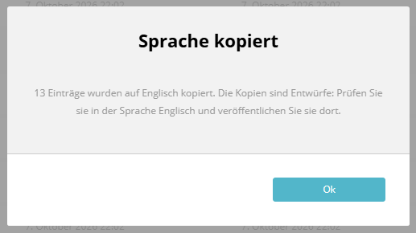

# Ergebnis einer Sammelaktion

Nach einer Sammelaktion zeigt das Bundle einen Dialog, wenn nicht alle markierten Einträge bearbeitet werden konnten.
Der Dialog nennt jede Gruppe für sich, in der Sprache der Benutzeroberfläche, und lässt technische Meldungen weg, wo es geht.



---

## Gruppen

| Gruppe               | Bedeutung                                                                                      | Beispiel                                                                                              |
|----------------------|------------------------------------------------------------------------------------------------|-------------------------------------------------------------------------------------------------------|
| Erledigt             | Die Aktion wurde ausgeführt.                                                                   | „3 Einträge wurden veröffentlicht.“                                                                   |
| Sprache fehlt        | Der Eintrag hat keine Fassung in der gewählten Sprache. Er wird vorab erkannt und übersprungen. | „14 Einträge haben keine Fassung auf Englisch und wurden übersprungen. Wählen Sie oben eine andere Sprache oder legen Sie die Fassung zuerst an.“ |
| Keine Berechtigung   | Die Rolle darf diesen Eintrag nicht veröffentlichen oder löschen (z. B. andere Artikelgruppe). | „2 Einträge wurden übersprungen, weil Ihnen die Berechtigung fehlt.“                                  |
| Fehlgeschlagen       | Ein anderer Fehler. Die ersten fünf Einträge werden mit Titel und Meldung aufgelistet.          | „Sommerfest“: Transition "unpublish" is not enabled.                                               |

Der Titel des Dialogs lautet „Sammelaktion teilweise ausgeführt“, wenn mindestens ein Eintrag erledigt wurde, sonst „Sammelaktion nicht ausgeführt“.
Wurde alles erledigt, erscheint kein Dialog.

Der Sprachname kommt aus dem Browser (`Intl.DisplayNames`), z. B. „Englisch“ für `en`. Kennt der Browser die Sprache nicht, steht dort das Kürzel.

---

## Antwort des Endpunkts

`POST /admin/api/bulk-actions/{resourceKey}/{action}?locale=en` liefert die Zahlen jeder Gruppe:

```json
{
    "error": "14 entries have no content in locale \"en\" and were skipped.",
    "done": 0,
    "missing": 14,
    "denied": 0,
    "failed": 0,
    "locale": "en",
    "failures": []
}
```

| Feld       | Inhalt                                                                         |
|------------|--------------------------------------------------------------------------------|
| `success`  | `true`, wenn mindestens ein Eintrag erledigt wurde                             |
| `error`    | englische Zusammenfassung für API-Clients, wenn nichts erledigt wurde          |
| `missing`  | Einträge ohne Fassung in `locale`                                              |
| `denied`   | Einträge ohne Berechtigung                                                     |
| `failed`   | Einträge mit anderem Fehler                                                    |
| `failures` | Liste `{id, title, message}`; `title` ist `null`, wenn der Handler keinen kennt |

| Status | Wann                                                    |
|--------|---------------------------------------------------------|
| 200    | mindestens ein Eintrag erledigt                         |
| 422    | nichts erledigt, Einträge ohne Fassung in der Sprache   |
| 403    | nichts erledigt, nur Einträge ohne Berechtigung         |
| 500    | nichts erledigt, mindestens ein Eintrag fehlgeschlagen  |

---

## Eigene Handler

Die Gruppe „Sprache fehlt“ und die Titel in den Fehlermeldungen gibt es für jeden Handler, der zusätzlich
`Manuxi\SuluBulkActionsBundle\Handler\EntryInfoProviderInterface` umsetzt:

| Methode                                    | Rückgabe                                              |
|--------------------------------------------|-------------------------------------------------------|
| `findMissingInLocale(array $ids, $locale)` | IDs der Einträge ohne Inhalt in der Sprache           |
| `getTitles(array $ids, $locale)`           | `[ID => Titel]`, bevorzugt in der Sprache             |

Für Inhalte nach dem Muster von Sulu 3 (Entity mit `dimensionContents`, Dimension mit `locale`, `stage`, `version`
und optional `title`) übernimmt das `DimensionContentLookup`:

```php
use Manuxi\SuluBulkActionsBundle\Handler\DimensionContentLookup;

$lookup = new DimensionContentLookup($entityManager, MyEntity::class);

public function findMissingInLocale(array $ids, string $locale): array
{
    return $this->lookup->findMissingInLocale($ids, $locale);
}

public function getTitles(array $ids, string $locale): array
{
    return $this->lookup->getTitles($ids, $locale);
}
```

Artikel, Schnipsel, Testimonials und Events bringen das bereits mit. Handler ohne das Interface funktionieren weiter;
ihre Fehler erscheinen dann mit ID statt Titel.
